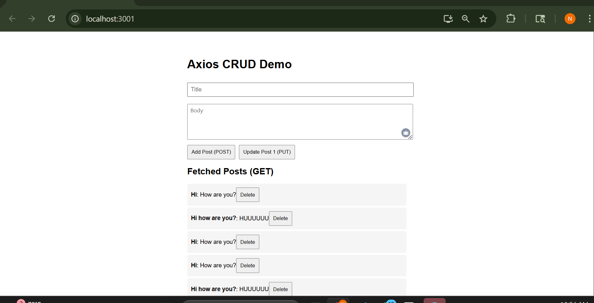

# Axios CRUD Demo 

This is a simple React app that demonstrates **CRUD operations** (Create, Read, Update, Delete) using **Axios** and the [JSONPlaceholder API](https://jsonplaceholder.typicode.com/).

> Perfect for practicing API calls and learning Axios in React.

---

## 🖼Screenshot



---

## Features

- ✅ **GET** – Fetch a list of posts
- ✅ **POST** – Add a new post
- ✅ **PUT** – Update post with ID = 1
- ✅ **DELETE** – Delete any post from the UI
- ✅ Handles non-unique ID bug using `Date.now()`
- ✅ Clean and readable UI with basic styling

---

## 🛠️ Technologies Used

- React
- Axios
- JSONPlaceholder API
- CSS (no frameworks)

---

## Getting Started

### 1. Clone the Repo

```bash
git clone https://github.com/tnikhilchowdary/Axios-Crud-Demo.git
cd Axios-Crud-Demo
